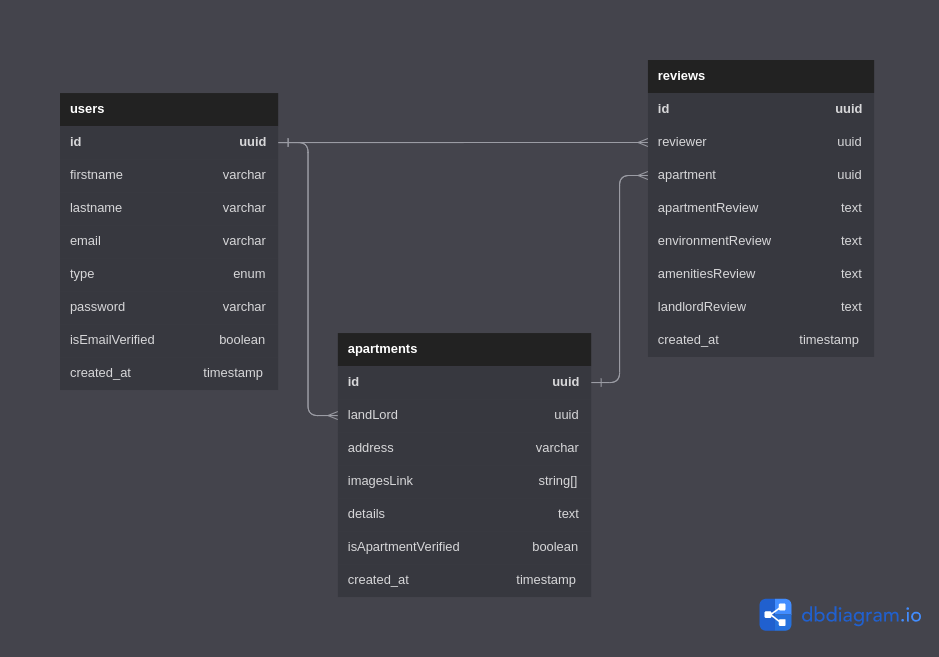

## Description

This project serves as a back-end for a platform known as bRent, which enables landlords to offer their apartments for rental. In addition, other users can review apartments listed on the platform. The project is developed using `NestJS`, `TypeORM`, `Docker` and `TypeScript`, and is documented with `Swagger`. User authentication is implemented using the JSON Web Token (`JWT`) standard.

## DB Design 



## 
## Running the app

```
# development
$ pnpm run start

# watch mode
$ pnpm run start:dev

# production mode
$ pnpm run start:prod
```

## Installation

1. Clone the repository to your local machine:
```bash
git clone https://github.com/MrCarbene/brent.git
```

2. Navigate to the project directory and install dependencies:
```bash
Copy code
cd brent
npm install
```
3. Create a `.env` file in the root directory and add the following environment variables:
```bash
DB_HOST=localhost
DB_PORT=5433
DB_USER=postgres
DB_PASSWORD=password0example
DB_NAME=brent

AUTH_SECRET=jwt_secret
JWT_EXPIRES_IN=30d
```

4. Start Docker Compose 
```bash
docker compose up
```

5. Start the server:
```bash
npm run start:dev
```

5. Access the API documentation at http://localhost:3000/api-docs

## Usage

The API provides the following endpoints:

**Auth**
```
POST /auth/register - allow users to register
POST /auth/login - allow users to login
```
**User**
```
GET /users/:userId - get User Profile
PATCH /users/:userId - update User Id
```
**Apartment**
```
POST /apartments - create a new apartment
GET /apartments/ - get details for all aviable apartments
GET /apartments/:id - get details for a specific apartment
PUT /apartments/:id - update an existing apartment
DELETE /apartments/:id - delete an apartment
```
**Review**
```
POST /apartments/:apartmentId/reviews - create a new review to a specific apartment
GET /apartments/:apartmentId/reviews - get details for all avaiable reviews for a specific apartment
GET /apartments/:apartmentId/reviews/:reviewId - get details for a specific review
PUT /apartments/:apartmentId/reviews/:reviewId - update an existing review
DELETE /apartments/:apartmentId/reviews/:reviewId - delete a review
```
